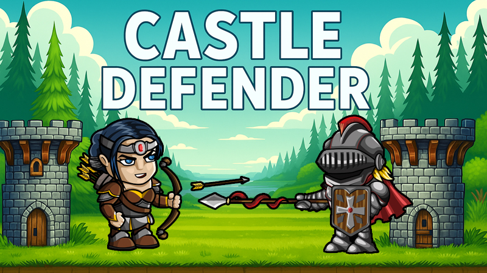

# 🏰 Castle Defender

Remake klasické strategické hry **Age of War**, postavený v moderním prostředí pomocí **React + TypeScript**.


- [Hru spustíte kliknutím zde](https://janhousa.github.io/ageofwarReact/)

## 🎮 O hře

**Castle Defender** je 2D strategická webová hra, kde je vaším cílem bránit svou věž, porazit nepřítele a postupně se vyvíjet přes různá historická období.

Hra je rozdělena do **3 evolučních období** – každé z nich přináší nové jednotky, lepší věž a nové možnosti.

## 🧠 Herní mechaniky

- **Evoluce**  
  Postupně se posouváte historickými epochami (např. doba kamenná → středověk → moderní doba). Každý krok přináší novou vizuální i strategickou vrstvu.

- **Jednotky**  
  Každá evoluce má unikátní typy vojáků. Správná volba a časování jejich nasazení je klíčem k vítězství.

- **Věž a obrana**  
  Vaši základnu lze vylepšovat o různé zbraně, které automaticky útočí na nepřátelské jednotky.

- **Ekonomika**  
  Klíčem k vítězství je efektivní správa zdrojů. Vyvažujte útoky, obranu a šetření na evoluci.

## 🧱 Použité technologie

- ⚛️ [React](https://reactjs.org/)
- ⌨️ TypeScript

## 🚀 Spuštění projektu

```bash
git clone https://github.com/tvoje-jmeno/castle-defender.git
cd CastleDefender
npm install
npm run dev
